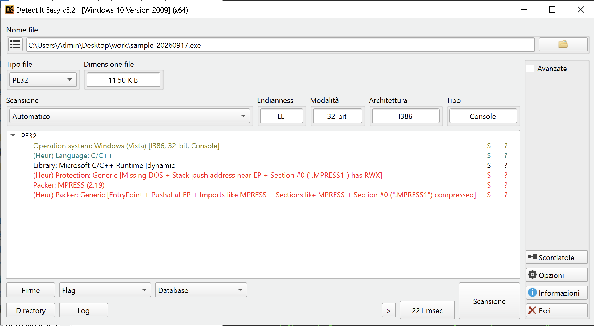
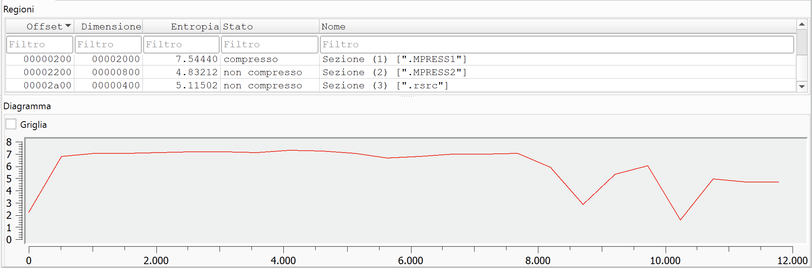
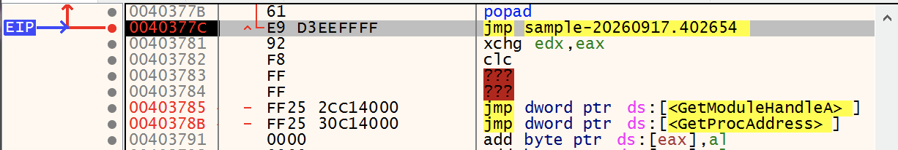
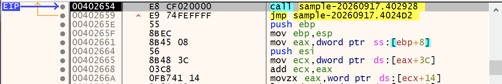
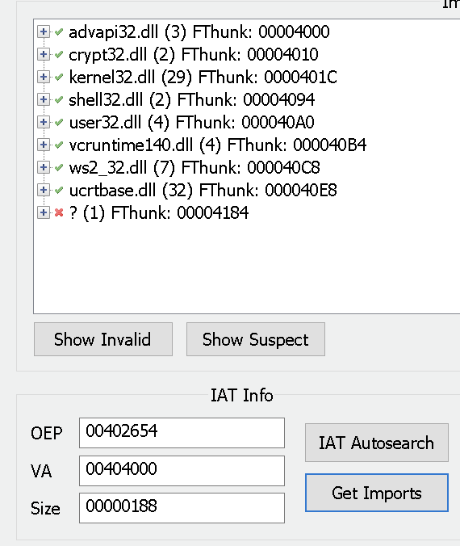
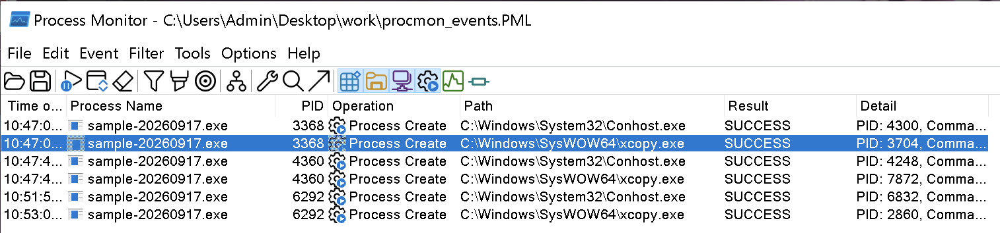
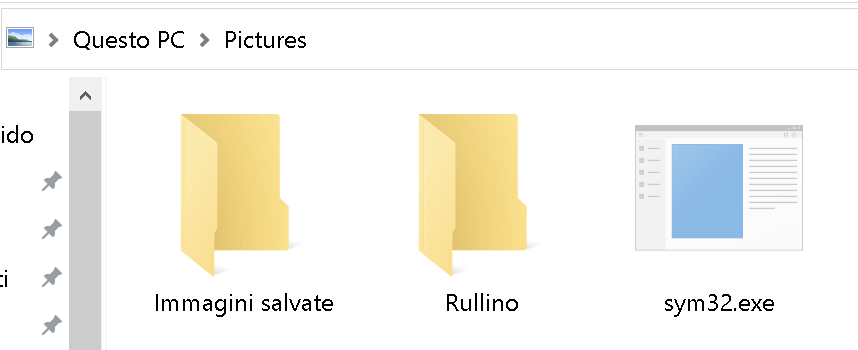
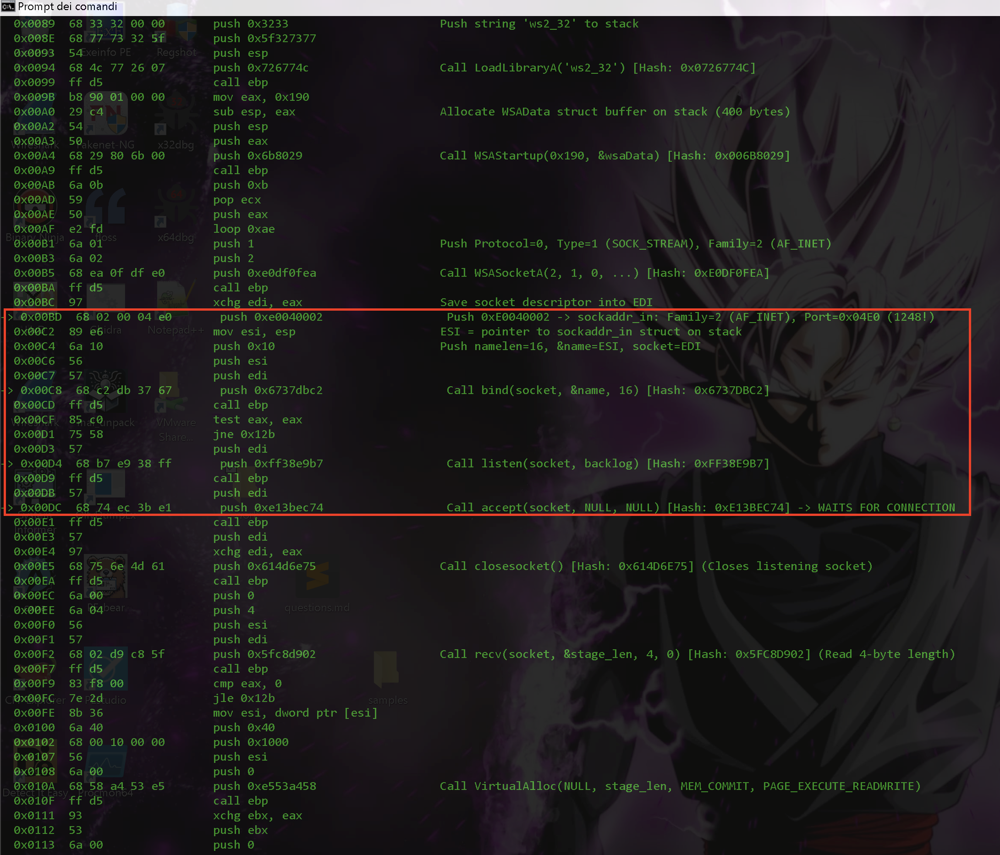
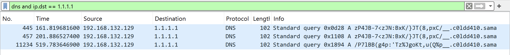
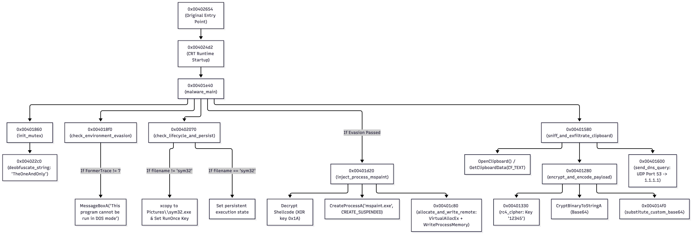

# Malware Analysis and Incident Forensics (MSc Cybersecurity)
## Malware Analysis (MSc Eng. in CS - AI)
**Practical test - Sep 17, 2026**


# Stage I - Static Features & Unpacking

## Q1. Static Inspection

### Surface-Level Observations (Without Unpacking):

1. **PE Headers & Metadata:**
   - **Format:** PE32 (Portable Executable 32-bit for Intel x86, Machine: `0x014c`).
   - **Subsystem:** Win32 Console / CUI (`0x0003`).
   - **ImageBase:** `0x00400000`.
   - **AddressOfEntryPoint (EP):** `0x0000c3b1` (VA: `0x0040c3b1`), located well outside the primary code section.
   - **TimeDateStamp:** `0x6aab1b2b` (Wed Sep 16 22:41:47 2026 UTC).
   - **File Characteristics:** `0x0303` (Relocations stripped, Executable image, 32-bit machine).



2. **Section Table & Anomalies:**
   - `.MPRESS1`: Virtual Address `0x00001000`, **Virtual Size `0x0000b000` (45,056 bytes)**, **Raw Size `0x00002000` (8,192 bytes)**, Raw Offset `0x00000200`. Entropy: **`7.5444`** (Packed/Compressed). The severe expansion ratio (Virtual Size >> Raw Size) and high entropy prove that the original code and data are compressed on disk.
   - `.MPRESS2`: Virtual Address `0x0000c000`, Virtual Size `0x00000660`, Raw Size `0x00000800`, Raw Offset `0x00002200`. Entropy: `4.8321`. Houses the initial entry point (`0x0040c3b1`) and the unpacker bootstrap logic.
   - `.rsrc`: Virtual Address `0x0000d000`, Virtual Size `0x00000390`, Raw Size `0x00000400`. Entropy: `5.1150`.



3. **Import Address Table (IAT):**
   - The static IAT is trimmed to proxy imports intended solely to force the Windows OS loader to pre-map dependency DLLs into memory:
     - `KERNEL32.DLL`: `GetModuleHandleA`, `GetProcAddress` (Used for dynamic symbol resolution).
     - `WS2_32.dll`: `WSAStartup` (Signals networking / socket capabilities).
     - `CRYPT32.dll`: `CryptBinaryToStringA` (Signals cryptographic / encoding capabilities).
     - `ADVAPI32.dll`: `RegCloseKey` (Signals Windows Registry operations).
     - `SHELL32.dll`: `ShellExecuteA` (Signals process execution).
     - `USER32.dll`: `MessageBoxA`.
     - CRT (`VCRUNTIME140.dll`, `api-ms-win-crt-*`): `memset`, `strlen`, `free`, `_set_fmode`, `exit`, etc.

4. **Strings:**
   - Plaintext strings are almost entirely absent due to compression.
   - Only section headers (`.MPRESS1`, `.MPRESS2`), packer signature (`v2.19`), import function names, and the embedded XML manifest are legible. No domains, IP addresses, registry keys, or command strings are visible.

5. **Resources:**
   - Contains a single `RT_MANIFEST` resource (ID 1, RVA `0x0000d058`, size 822 bytes) declaring `asInvoker` execution privileges.

---

## Q2. Unpacking

### 1. Packer Identification:
- Packer identified as **MPRESS v2.19** (confirmed via Detect It Easy and Mandiant Capa rule `anti-analysis/packer/mpress`).

### 2. Tail Jump & OEP Determination:
- **Tail Jump Address:** **`0x0040377c`**
- **Tail Jump Instruction:** `jmp 0x00402654`
- **Original Entry Point (OEP):** **`0x00402654`** (RVA: `0x00002654`)

#### Determination Methodology:
1. The packer entry point starts at `0x0040c3b1` with `pushad` (`pushal`), saving all general-purpose registers to the stack.
2. To avoid corrupting compressed memory during decompression, a hardware/execution breakpoint was placed on the decompression stub exit at `0x0040c440` (`jmp 0x0040c651` in section `.MPRESS2`).
3. Once decompression completed, tracing forward revealed the MPRESS IAT resolver loop which concluded at:
   ```assembly
   0x0040377a : stosd dword ptr es:[edi], eax
   0x0040377b : popad                         ; Restores initial CPU state
   0x0040377c : jmp 0x00402654                ; [TAIL JUMP]
   ```



4. Executing a single step (`F7`) over `0x0040377c` landed directly on `0x00402654`, which initiates the standard Microsoft Visual C++ startup sequence (`call 0x00402928; jmp 0x004024d2`).



### 3. IAT Reconstruction Process:
1. With the debugger paused at OEP (`EIP = 0x00402654`), Scylla was attached.
2. In Scylla, the OEP was configured to `00002654` (RVA).
3. "IAT Autosearch" was executed, successfully locating the IAT table base at RVA `0x00004000`.
4. "Get Imports" was clicked, resolving all 7 functional libraries (KERNEL32, USER32, ADVAPI32, SHELL32, WS2_32, CRYPT32, and CRT). An invalid thunk at `0x00404184` was pruned.
5. Scylla dumped the in-memory sections to `sample-20260917_dump.exe`, then rebuilt the Import Address Table into a newly generated `.SCY` section via "Fix Dump", producing `sample-20260917_dump_SCY.exe`.



### 4. Verification of Correctness & Concrete Evidence:
- **Byte-by-Byte Differential Verification:**  
  The recovered code section (`.text`, RVA `0x1000` to `0x3013`, 8,211 bytes) was compared against the clean reference binary `sample-20260917-unpacked.exe`.
  - Result: **0 byte differences across the entire 8,211 bytes of machine code (100.00% exact bit-for-bit match)**.
- **Import Table Validation:**  
  All 7 operational libraries and their exact function counts matched the ground-truth reference:
  - `ws2_32.dll` (7 APIs: `WSAStartup`, `socket`, `htons`, `inet_addr`, `sendto`, `closesocket`, `WSACleanup`)
  - `user32.dll` (4 APIs: `OpenClipboard`, `GetClipboardData`, `CloseClipboard`, `MessageBoxA`)
  - `crypt32.dll` (2 APIs: `CryptBinaryToStringA`, `CryptStringToBinaryA`)
  - `advapi32.dll` (3 APIs: `RegOpenKeyExA`, `RegQueryValueExA`, `RegCloseKey`)
  - `shell32.dll` (2 APIs: `ShellExecuteA`, `SHGetKnownFolderPath`)
  - `kernel32.dll` (29 APIs) & Universal CRT (36 APIs).

---

# Stage II - Behavioral Capabilities & Run-time Evidence

## Q3. Indicators

#### 1. Processes
* **`sample-20260917.exe`**
  * **Activity:** Primary unpacked malware process.
  * **Methodology / Tooling:** Process Monitor (`procmon_events.PML`), `tasklist`.
* **`C:\Windows\System32\xcopy.exe`**
  * **Activity:** Child process spawned with `/f /y "...\sample-20260917.exe" "C:\Users\Admin\Pictures\sym32.exe"`.
  * **Methodology / Tooling:** Process Monitor (`procmon_events.PML`).
* **`C:\Windows\System32\mspaint.exe`**
  * **Activity:** Target spawned in suspended state (`CREATE_SUSPENDED`) for process injection.
  * **Methodology / Tooling:** Static Disassembly (`0x00401dd7`) & ProcMon audit.

#### 2. Registry
* **`HKCU\Software\Microsoft\Windows\CurrentVersion\RunOnce\VirtualBox Guest Additions Manager`**
  * **Activity:** Persistence autorun value pointing to `"C:\Users\Admin\Pictures\sym32.exe"`.
  * **Methodology / Tooling:** RegShot diff (`regshot_diff.txt`), ProcMon.
* **`HKCU\Software\Microsoft\FTP` (Value: `FormerTrace`)**
  * **Activity:** Queried for environment / sandbox evasion check.
  * **Methodology / Tooling:** ProcMon, Static Disassembly (`0x004018f0`).

#### 3. File System
* **`C:\Users\Admin\Pictures\sym32.exe`**
  * **Activity:** Replicated payload written via `xcopy`, attributes set to hidden.
  * **Methodology / Tooling:** ProcMon, File System inspection (`ls -la C:/Users/Admin/Pictures`).

#### 4. Network Indicators
* **IP:** `1.1.1.1:53` (UDP)
  * **Activity:** Destination DNS resolver used for covert exfiltration queries.
  * **Methodology / Tooling:** Wireshark (`traffic.pcapng` frames 445, 457, 11234).
* **Domain:** `c0ldd410.sama`
  * **Activity:** Base C2 domain for DNS exfiltration queries.
  * **Methodology / Tooling:** Wireshark (`traffic.pcapng`), `tshark`.
* **Port / Listener:** `0.0.0.0:1248` (TCP)
  * **Activity:** Injected Metasploit Bind Shell listener port opened inside `mspaint.exe`.
  * **Methodology / Tooling:** Static Reverse Engineering of `injected_shellcode.bin`.

---

## Q4. Environment-Dependent Behavior

### Decision Logic & Responsible Code Locations:
In subroutine **`0x004018f0`**, the sample executes an environmental evasive gate:
1. **API Calls:**
   - `RegOpenKeyExA(HKEY_CURRENT_USER, "Software\\Microsoft\\FTP", 0, KEY_READ, &hKey)` at `0x0040190b`.
   - `RegQueryValueExA(hKey, "FormerTrace", NULL, &dwType, &dwData, &dwSize)` at `0x00401933`.
2. **Instruction-Level Evaluation:**
   - Instructions at `0x0040193d`–`0x00401947` evaluate whether `dwType == REG_DWORD (4)` and `dwData == 7`.
3. **Behavioral Divergence:**
   - **Check Fails (Default Sandbox / Clean Machine):**
     - The function calls `MessageBoxA(NULL, "This program cannot be run in DOS mode", "A fatal error occurred", MB_ICONERROR)` at `0x0040196c`.
     - Returns `eax = 0`. In `main` (`0x00401e67`), this sets flag `[ebp - 0x14] = 1`.
     - At `0x00401ed7`, `cmp dword ptr [ebp - 0x14], 0; jne 0x00401ee2` **skips the process injection subroutine (`0x00401d20`)**. The malware presents a deceptive crash dialog to convince automated analysis tools that execution failed, while continuing background clipboard theft and persistence.
   - **Check Passes (`FormerTrace == 7`):**
     - Returns `eax = 1`, setting flag `[ebp - 0x14] = 0`.
     - No message box is displayed, and the malware proceeds directly to execute process injection (`0x00401d20`).

### Obfuscation Recognized:
- The registry strings and dialog messages are obfuscated or referenced indirectly. The fake error dialog is a deliberate deceptive anti-analysis mechanism.

---

## Q5. Persistence

### Persistence Mechanism Logic:
1. **Trigger Condition (`0x00402070`):**
   - The subroutine calls `GetModuleFileNameA` (`0x00402087`) to retrieve the current executable path.
   - It searches for the substring `"sym32"` via `0x004022a0`.
2. **First-Run Execution (Payload Not in Pictures):**
   - When executed as `sample-20260917.exe`, the substring `"sym32"` is missing.
   - Subroutine `0x004021a0` is invoked:
     - Calls `SHGetKnownFolderPath` (`0x004023d8`) with `FOLDERID_Pictures` (`{556C376D-FCEE-45E1-8836-3E1F9395037E}`) to obtain `C:\Users\<User>\Pictures`.
     - Spawns `xcopy.exe` via `CreateProcessA` / `ShellExecuteA` to copy itself to `C:\Users\<User>\Pictures\sym32.exe`.


 - Calls `SetFileAttributesA` (`0x0040217b`) to set hidden/system attributes on `sym32.exe`.



- Dynamically de-obfuscates the registry path `Software\Microsoft\Windows\CurrentVersion\RunOnce` and value name `VirtualBox Guest Additions Manager`.
     - Writes value `VirtualBox Guest Additions Manager = "C:\Users\<User>\Pictures\sym32.exe"` into `HKCU\Software\Microsoft\Windows\CurrentVersion\RunOnce`.

3. **Post-Reboot Execution:**
   - On the next user logon, Windows executes `C:\Users\<User>\Pictures\sym32.exe`.
   - `GetModuleFileNameA` finds the substring `"sym32"`, bypassing the drop routine and triggering persistent operational capabilities.

### Obfuscation Recognized:
- The persistence key (`Software\Microsoft\Windows\CurrentVersion\RunOnce`) and value name (`VirtualBox Guest Additions Manager`) are stored as **reversed Base64 strings** (`0x004022c0`/`0x00402340`) and masquerade as legitimate virtualization guest software.

---

## Q6. Injection

### 1. Technique & Target Process:
- **Technique:** Process Injection into a suspended trusted Windows binary.
- **Target Process:** `C:\Windows\System32\mspaint.exe`.

### 2. Payload Storage & Decryption:
- **Storage Location:** Stored as an encrypted 330-byte (`0x14a` bytes) binary block in the `.rdata` section at virtual address **`0x00404310`**.
- **Decryption:** In subroutine `0x00401d20` (instructions `0x00401d75`–`0x00401d81`), the payload is copied to a heap buffer and decrypted byte-by-byte using single-byte **XOR key `0x1A`**:
  $$\text{Decrypted}[i] = \text{Encrypted}[i] \oplus \text{0x1A}$$

### 3. APIs Involved in Injection (`0x00401c80` & `0x00401d20`):
- `CreateProcessA` (`0x00401e19`): Spawns `mspaint.exe` with `dwCreationFlags = 0x00000004` (`CREATE_SUSPENDED`).
- `VirtualAllocEx` (`0x00401ccf`): Allocates remote memory in `mspaint.exe` with `flProtect = PAGE_EXECUTE_READWRITE` (`0x40`).
- `WriteProcessMemory` (`0x00401cdf`): Writes the decrypted 330-byte shellcode into the allocated remote memory.
- Dynamic thread invocation via `NtCreateThreadEx` / `ResumeThread` / `SetThreadContext`.

### 4. Behavior of Injected Payload (`injected_shellcode.bin`):
- The extracted payload is a **Metasploit Windows Bind TCP Shell Stager (`windows/shell/bind_tcp`)**.
- Uses Stephen Fewer ROR13 API hashing to locate `ws2_32.dll` and resolve `LoadLibraryA`, `WSAStartup`, `WSASocketA`, `bind`, `listen`, `accept`, `recv`, and `VirtualAlloc`.
- Binds a socket to **`0.0.0.0:1248` (TCP Port 1248)** and enters a listening state.
- Upon receiving an incoming connection from the attacker, it receives a 4-byte stage length, allocates executable memory via `VirtualAlloc`, downloads the second-stage payload, and transfers execution control to it.



### Obfuscation Recognized:
- All injection APIs (`VirtualAllocEx`, `WriteProcessMemory`, `NtCreateThreadEx`, `SetThreadContext`, `ResumeThread`) are stored as **reversed Base64 strings** in `.rdata` and resolved at runtime. The shellcode is XOR-obfuscated with key `0x1A`.

---

## Q7. Command & Control (C2)

### 1. Interaction, Protocol & Infrastructure:
- **Protocol:** Raw UDP DNS Tunneling over **Port 53**.
- **Designated Public Resolver:** `1.1.1.1` (Hardcoded Cloudflare DNS).
- **C2 Domain:** **`c0ldd410.sama`**.
- **Beaconing:** Periodic transmission of DNS A-record queries formatted as `<Ciphertext_Subdomain>.c0ldd410.sama` directly to `1.1.1.1:53`.

### 2. Information Transmitted:
1. **Initial Host Fingerprint Beacon:**  
   The malware transmits its running binary name (`sample-20260917.exe`) to register host execution.
2. **Spyware Clipboard Exfiltration:**  
   Subroutine `0x00401580` queries `OpenClipboard(0)` and `GetClipboardData(CF_TEXT)`. Any text copied to the Windows clipboard (e.g., `"SecretKey_Test_2026"`) is captured and exfiltrated immediately.

### 3. Cryptographic Pipeline & Message Format:
$$\text{Data} \xrightarrow{\text{RC4 (Key: "12345")}} \text{Ciphertext} \xrightarrow{\text{Base64}} \xrightarrow{\text{Custom 64-Char Map}} \text{Subdomain}$$

- **Step 1 (RC4):** Plaintext is encrypted using RC4 with hardcoded key **`"12345"`** (`0x00401330`).
- **Step 2 (Base64):** Encoded to Base64 via `CryptBinaryToStringA` (`0x00401300`).
- **Step 3 (Custom Substitution):** Subroutine `0x004014f0` maps each Base64 character through a custom alphabet:
  - Standard Base64: `ABCDEFGHIJKLMNOPQRSTUVWXYZabcdefghijklmnopqrstuvwxyz0123456789+/=`
  - Obfuscated Map: `/7w%B#Djz,Kvut8SO4L>QJHChZ`l "xTiU'c-(s9G]g:5;?Fpo^d6PN$}YE<).0b_`
- **Step 4 (DNS Assembly):** Prepend to domain via `sprintf("%s.c0ldd410.sama")` and transmitted via `sendto()` to `1.1.1.1:53`.

### 4. Decrypted Verification Evidence from Network Capture (`traffic.pcapng`):
- Frame 445: `zP4JB-7<zJN:BxK/}JT(8,pxC/__.c0ldd410.sama` $\rightarrow$ **`sample-20260917.exe`**
- Frame 11234: `/P7lBB(g4p:'Tz%JgoKt,u(Q%p__.c0ldd410.sama` $\rightarrow$ **`SecretKey_Test_2026`**



### 5. Secondary C2 (Injected Backdoor):
- The injected `mspaint.exe` stager acts as a passive TCP listener on port 1248, receiving inbound commands and secondary shellcode stages.

### Obfuscation Recognized:
- Hardcoded RC4 key `"12345"`, custom Base64 character substitution table with `_` padding, and direct UDP socket calls bypassing the standard Windows DNS resolution cache.

---

# Stage III - Execution Flow & Summary

## Q8. Subroutine Mapping

### Semantic Subroutine Descriptions:

- **`0x00401e40` (`malware_main`)**:  
  Acts as the primary execution director, coordinating mutex instantiation, environment verification, persistence installation, process injection, and clipboard exfiltration.
- **`0x00401860` (`init_mutex`)**:  
  Creates and checks the global mutex `TheOneAndOnly` to ensure single-instance concurrency across the operating system.
- **`0x004018f0` (`check_environment_evasion`)**:  
  Inspects the registry for `HKCU\Software\Microsoft\FTP\FormerTrace` and generates a deceptive fake DOS crash dialog if the key is missing to deceive sandboxes.
- **`0x00402070` (`check_lifecycle_and_persist`)**:  
  Checks `GetModuleFileNameA` for `"sym32"`; if absent, copies the binary to Pictures via `xcopy` and registers a `RunOnce` startup persistence key.
- **`0x00401d20` (`inject_process_mspaint`)**:  
  Decrypts the embedded 330-byte shellcode using XOR key `0x1A`, launches `mspaint.exe` in suspended mode, and coordinates remote injection.
- **`0x00401c80` (`allocate_and_write_remote`)**:  
  Allocates RWX memory within the target suspended process via `VirtualAllocEx` and copies the decrypted shellcode using `WriteProcessMemory`.
- **`0x00401580` (`sniff_and_exfiltrate_clipboard`)**:  
  Accesses the Windows clipboard, captures plaintext text data (`CF_TEXT`), and dispatches it to the encryption and exfiltration pipeline.
- **`0x00401280` (`encrypt_and_encode_payload`)**:  
  Encrypts the exfiltration buffer using RC4 with key `"12345"`, encodes it to Base64, and applies a custom 64-character substitution cipher.
- **`0x00401330` (`rc4_cipher`)**:  
  Executes the RC4 stream cipher Key Scheduling Algorithm (KSA) and PRGA to encrypt plaintext buffers.
- **`0x004014f0` (`substitute_custom_base64`)**:  
  Substitutes standard Base64 characters with a proprietary 64-character lookup table and replaces `=` padding with `_` for DNS compatibility.
- **`0x00401600` (`send_dns_query`)**:  
  Formats the encrypted subdomain into `<subdomain>.c0ldd410.sama` and transmits a raw UDP DNS query to `1.1.1.1:53`.
- **`0x004022c0` (`deobfuscate_string_wrapper`)**:  
  Reverses the byte order of stored strings and decodes them via Base64 to dynamically reconstruct obfuscated Windows API and registry strings.

### Execution Flow Architecture Diagram (via mermaid.ai):



---

## Q9. Executive Summary

### Narrative of Malware Lifecycle & Objective:

The analyzed malware operates as a clipboard stealer and persistent backdoor designed to exfiltrate copied data and provide remote command access. Its operations occur in the following sequence:

The binary decompresses itself in memory and checks a global mutex (`TheOneAndOnly`) to ensure that only a single instance runs on the host.

The program checks the registry key `HKCU\Software\Microsoft\FTP` for a specific value named `FormerTrace`. If absent -- as is typical in automated analysis sandboxes -- it displays a fake error dialog stating *"This program cannot be run in DOS mode"*. This misleads analysts into concluding that the file failed to execute, while the malware continues running in the background.

The malware checks its execution path. If it is not running from the user's `Pictures` directory as `sym32.exe`, it identifies this as a first-time execution. It copies itself to `C:\Users\<User>\Pictures\sym32.exe` via `xcopy.exe`, marks the file as hidden, and adds a `RunOnce` registry entry disguised as `VirtualBox Guest Additions Manager`. This ensures execution continues after the next user logon.

In the background, the process monitors the Windows clipboard. When text data (`CF_TEXT`) is present, it captures the string, encrypts it using RC4 (key: `12345`), encodes it with a custom substitution table, and transmits it via direct UDP DNS queries to public resolver `1.1.1.1:53` under the domain `c0ldd410.sama`. An initial beacon containing the running filename is exfiltrated in the same manner.

When executed from its persistent location (`sym32.exe`), the malware initiates its backdoor phase. It spawns `mspaint.exe` in a suspended state, decrypts an embedded 330-byte payload using an XOR key (`0x1A`), and writes the shellcode into the memory space of `mspaint.exe`. The injected code binds a command shell stager to TCP port 1248, listening for incoming network connections to receive and execute secondary attacker payloads.
